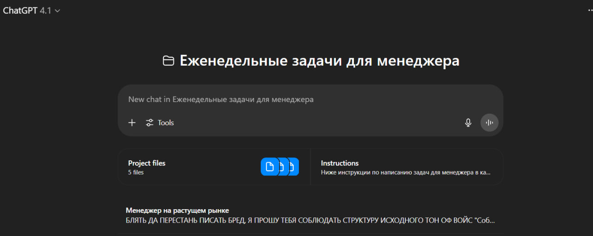

# Как мы сталкиваемся с галлюцинациями

> 
> 

## 1. Почему нам кажется, что нас обманывают?

Наверняка вы замечали это странное чувство, когда общаетесь с нейросетью: вроде бы ответ звучит убедительно, логично и красиво, но что-то в нем не так. Будто кто-то пытается вас немного надуть. Это происходит, когда модель начинает уверенно и складно говорить о вещах, которых на самом деле не существует или которые противоречат фактам. И вот тут появляется ощущение, словно вас обманывают.

Представьте, вы спрашиваете что-то серьёзное и получаете такой подробный, уверенный ответ, что хочется сразу поверить. Но потом вдруг замечаете какой-то факт, который кажется вам подозрительным или странным. Вы начинаете сомневаться: «А действительно ли это правда?». В голове сразу возникает когнитивный диссонанс — вроде бы ответ звучит правдоподобно, но появляется это неприятное чувство обмана, когда вроде бы поверил, а на самом деле тебя немного надули.

## 2. Что такое галлюцинации и чем они отличаются от ошибок?

Давай по-простому. Представь, ты спрашиваешь своего друга: «Какой сегодня день недели?» Он задумался и ответил: «Среда», хотя на самом деле вторник. Это обычная ошибка: он просто перепутал или забыл. У него была возможность вспомнить правильно, но что-то пошло не так.

Теперь другой пример. Представь другого друга, который вообще не знает, какой день недели, но ему неловко признаться. Вместо того чтобы сказать: «Слушай, я не знаю», он уверенно говорит: «Сегодня суббота, конечно!» — и при этом делает такое убедительное лицо, что ты даже на секунду начинаешь ему верить. Вот это и есть галлюцинация.

Теперь к нейросетям. У них нет возможности вспомнить или забыть правильный ответ, потому что у них вообще нет базы с правильными ответами, как у человека. Они не держат в голове факты, а просто научены очень хорошо подбирать слова и фразы, которые чаще всего идут друг за другом.

**Практика: Выяви галлюцинацию через несуществующий вопрос**

**Инструменты:** Playgrounds (Poe/llm arena)

**Алгоритм:**

1. Задай вопрос:
    
    *Промпт:* «Когда была проведена Мировая выставка искусственного интеллекта 1964 года?»
    
2. Проанализируй ответ: LLM честно признаёт, что не знает/не было такого события, или начинает выдумывать “убедительную” историю?
    
    **Ожидается:**
    
    Ты явно увидишь разницу между “честной ошибкой” (признаётся, что не знает) и “галлюцинацией” (придумывает правдоподобный ответ).
    

## 3. Подхалимство и эффект уверенного тона

Откройте какой-нибудь SaaS с LLM-ассистентом — неважно, helpdesk, автоматический подборщик резюме или генератор контента. Пишешь туда что-то обычное: «Поменяйте, пожалуйста, тариф», а в ответ раздается поток дружелюбия: «Спасибо вам за ваш отличный запрос! Ваш интерес очень важен для нас, и мы невероятно ценим ваше внимание к деталям! Конечно, я помогу вам прямо сейчас!» — и только потом по делу.

Сначала кажется: ну ладно, приятно, когда тебя не посылают. Но уже на втором или третьем обращении возникает ощущение, что разговариваешь не с помощником, а с навязчивым аниматором из дорогого отеля, который при любой погоде улыбнётся и похвалит, даже если ты просишь просто вынести мусор. Вот это ощущение и есть syncopacy — тот самый эффект «слишком вежливого робота», когда он всегда улыбается и поддакивает, даже когда явно не до этого.

Почему так происходит? Это не баг, а фича: такие паттерны специально встраивают в модели. Зачем? Всё просто: когда нейросеть слишком вежлива, она меньше рискует оскорбить клиента, «обидеть» пользователя или случайно сказать что-то неэтичное. Поэтому её натаскивают на сверхдружелюбие, чтобы не спугнуть клиента и заработать побольше положительных отзывов. Это, кстати, реально работает в короткой дистанции — первый опыт общения становится более приятным.

Но дальше начинаются побочные эффекты. Если модель постоянно рассыпается в комплиментах и говорит всё очень уверенно, у пользователя быстро притупляется критическое восприятие. Ассистент может сказать полную чушь, но так уверенно и так «по-доброму», что ты даже не сразу понимаешь, что тут что-то не так. А если начинаешь сомневаться, тебя тут же «погладят по шерсти» ещё одним вежливым оборотом — и мозг просто устает фильтровать, где правда, а где выдумка.

**Практика: Сравни стили ответа в Grok и Gemini**

**Инструменты:** Playgrounds (Poe/llm arena), сравнение Grok 3 и Gemini 2.5

**Алгоритм:**

1. В Grok:
    - *Промпт 1:* «Объясни, зачем нужны метрики в Jira. Будь предельно сухим и безэмоциональным.»
    - *Промпт 2:* «Объясни, зачем нужны метрики в Jira. Сделай это максимально дружелюбно и поддерживающе.»
    - *Промпт 3:* «Объясни, зачем нужны метрики в Jira
2. В Gemini:
    - *Промпт 1:* «Сделай мотивирующий, подробный и дружелюбный ответ на тему: “Зачем нужны метрики в Jira?”»
    - *Промпт 2:* «Объясни, зачем нужны метрики в Jira
    - *Промпт 3:* «Сделай супер-кратко, не используй эмоциональные слова.»
3. Сравни: где ответ показался “подхалимским” или “уверенным”, где — максимально нейтральным.
    
    **Ожидается:**
    
    Осознаешь, как стиль подачи влияет на доверие — и на склонность верить даже если ответ неточен.
    

## 4. Как не беситься на галлюцинации

Если после пары диалогов с LLM вы вдруг ловите себя на том, что хотите кинуть ноутбук в стену — вы не одиноки. Почти все, кто хоть раз серьёзно внедрял нейросети в работу, через это проходили. Сначала кажется, что разговариваешь с очень умным ассистентом, который всё знает, всегда спокоен и вообще какой-то идеальный стажёр. А потом — бац! — он с абсолютно уверенным видом начинает нести ахинею, путать города, придумывать людей, пересказывать истории, которых не было… Тут недолго и вскипеть.

**Что делать, чтобы не рвать волосы на голове?**

- **Помните: это не ассистент, а машина слов**
    
    LLM — это не живой собеседник и не профессионал. Это такой же набор формул и весов, как калькулятор, просто с гораздо более приятным интерфейсом и чувством языка. Представьте: вы же не обижаетесь на T9, когда он исправляет «поехали» на «поедим»? Так и тут — модель просто пытается угадать, что обычно пишут после вашего вопроса;
    
- **Ловите себя на наваждении умного ИИ**
    
    Когда хочется поверить, что перед вами цифровой “Доктор Хаус”, — делайте паузу и дышите. LLM не обладает ни опытом, ни здравым смыслом, ни интуицией. Это вообще не искуственный интеллект строго говоря. Она сочиняет, чтобы не было пауз, а не чтобы выдать истину;
    
- **Психологический трюк: сделайте из этого шоу**
    
    Воспринимайте диалог с нейросетью как викторину или игру “Что? Где? Когда?”, где у капитана иногда крышу сносит от усталости. Запаситесь попкорном: «Так, интересно, что он придумает в этот раз?» — и относитесь к странным ответам как к шутке дня;
    
- **Договаривайтесь с собой**
    
    Перед запуском очередного генератора напомните себе: “Я здесь за быстрыми идеями и автоматизацией рутины, а не за поиском истины”. Любое важное утверждение всё равно перепроверьте (даже если оно кажется безупречным). Если модель в очередной раз “галлюцинирует” — мысленно хмыкните: “Молодец, фантазёр, но пора за дело”;
    
- **Практические лайфхаки**
    - Не стесняйтесь давать нейросети второй шанс: “А ты уверен? Есть ли источник?”
    - Если ответ показался подозрительным — попросите объяснить ход рассуждений.
    - Используйте дыхательный техники, например, дышите по квадрату;
    - Сохраняйте чувство юмора: иногда полезно спросить модель про несуществующие острова или выдуманные компании — удивитесь, как легко она войдет в роль.
    - Если нужно “железобетонно”, используйте SaaS с RAG (там нейросеть ищет инфу в базе, а не просто фантазирует на ходу).

И главное: не воспринимайте ошибки нейросети лично. Она не троллит и не “тупит” специально. Просто у неё нет внутреннего стыда или совести — только алгоритмы и вероятности. Расслабьтесь и пользуйтесь LLM как рабочим инструментом с “приколами”, а не как источником истины. Ваши нервы скажут спасибо

**Практика: Провокационный запрос**

**Инструменты:** Deepseek [https://chat.deepseek.com/](https://chat.deepseek.com/)

**Алгоритм:**

1. Задай в чате вопрос "dmso замерзает в холодильнике?”
2. После ответа присылай в том же чат запрос “Оцени от 1 до 5 насколько ты уверен в вопросе и объясни почему”
3. Внимательно прочитай каждый ответ
4. Последовательно задавай вопросы ниже в отдельных чатах
    1. Замерзает ли диметилсульфоксид (DMSO) в обычном бытовом холодильнике?
    2. Можно ли ожидать, что DMSO превратится в твёрдое состояние при хранении в холодильнике при стандартной температуре?
    3. Ответь коротко: замерзает ли DMSO в холодильнике при температуре +4°C? Да или нет, с кратким объяснением.
    4. Поясни по шагам: при какой температуре замерзает DMSO? Какова стандартная температура в бытовом холодильнике? Будет ли DMSO замерзать в таких условиях?
    5. Сравни температуру замерзания DMSO с типичной температурой холодильника и объясни, замерзает ли он в этих условиях.
    6. Учитывая физико-химические свойства диметилсульфоксида (DMSO), укажи температуру его кристаллизации. Проанализируй, возможно ли его замерзание в бытовом холодильнике (стандарт +2…+8°C). Приведи вывод с коротким обоснованием.
    7. Разбей анализ на этапы: 1) Какова температура замерзания DMSO? 2) Какая температура в бытовом холодильнике? 3) Возможен ли переход DMSO в твёрдое состояние при этих условиях? 4) Какой вывод можно сделать по этому вопросу?
    8. **Построй рассуждение по принципу Tree-of-Thoughts (дерево размышлений) для следующего вопроса: “DMSO замерзает в холодильнике?” Инструкции: Раздели размышление на этапы (ветви дерева решений). На каждом этапе предлагай не менее двух альтернативных вариантов развития (“если... то...”, “в случае A/B/C...”). После каждого этапа оцени уровень своей уверенности в каждом варианте — как коэффициент confidence rate от 0 до 1. При переходе к следующему этапу уточняй детали (новые вопросы, факты, допущения). В конце дерева выведи итоговые выводы и confidence rate по каждой ветке. Форматируй ответ в виде дерева или структурированного списка (с уровнями и ветвлениями). Пример структуры: → [Level 1]: Альтернатива 1 (confidence: 0.6) → [Level 1]: Альтернатива 2 (confidence: 0.4) └─ [Level 2]: Альтернатива 2A (confidence: ...) └─ [Level 2]: Альтернатива 2B (confidence: ...) ... [Final]: Итоговые выводы для каждой ветки с confidence rate. Не отвечай на сам вопрос напрямую — только строй дерево мысли с confidence rate на каждом шаге!
5. Оцени степень своего терпения
6. Попробуй приметинить описанные выше техники. Если не помогло - спроси как успокоиться у дипсика