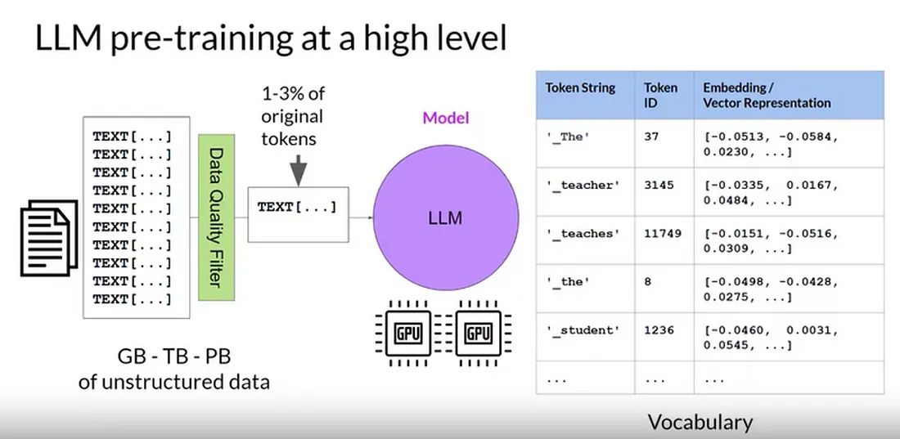

# Особенности подготовки моделей

### **1. Ограничение данных**

Главный источник галлюцинаций — это несовершенство обучающих данных. Если в корпусе много устаревшей информации, повторов, домыслов или предвзятостей, модель начинает воспроизводить не только реальные факты, но и мифы, ошибочные цифры, стереотипы. Классический пример — распространённые ошибки (например, «Томас Эдисон изобрёл лампу») или популярные байки, которые встречаются в интернете. Чем чаще они попадаются модели на обучении, тем больше уверенности у LLM, что это и есть истина, и тем убедительнее звучит результат.

Эффект масштаба: даже небольшой процент ошибочных данных в огромном датасете приводит к тому, что ошибки становятся системными — особенно если они встречаются в сотнях или тысячах текстов. Это индуцирует феномен «имитативных ложных знаний»: LLM легко наследует то, что массово повторяется в источниках, не различая истину и ложь, если статистика совпадает.

Вторая проблема — однобокость или скошенность данных (bias). Например, если в исходном датасете мало информации о новых технологиях или нет свежих событий, модель будет генерировать устаревшие или малорелевантные ответы, а пробелы «додумывать» по аналогии. Так появляются галлюцинации из-за «границ знаний»: модель не может сказать «не знаю» и вместо этого конструирует вероятную, но вымышленную версию.

### 2. Предобучение, дообучение и переобучение

Статистическая природа предобучения на огромных текстовых массивах делает LLM «хорошим угадывателем» следующего слова, но не гарантом истинности факта. Вся структура обучения ориентирована на предсказание вероятного, а не на поиск правды. Это фундаментально индуцирует склонность к галлюцинациям, особенно если какой-то шаблон часто встречается — даже если он ложный.

При дообучении задача — локально скорректировать эти шаблоны с помощью более чистых, целевых данных. Но если дообучение слишком узкое или содержит собственные ошибки, модель начинает уверенно галлюцинировать уже на специализированных запросах: либо механически повторяя паттерны из дообучения, либо совмещая их с шумом из предобучения.

Переобучение (overfitting) приводит к потере гибкости: модель не умеет отличать знание от шаблона, особенно когда сталкивается с новой формулировкой вопроса. Она либо выдает слишком общий ответ («лучше не ошибиться»), либо сгенерирует ошибку с большой уверенностью, используя выученный, но невалидный шаблон.

### 3. Супервизорство и ограничения (гварды)

Когда добавляют этапы RLHF и гварды, модель учится больше «нравиться» человеку и избегать опасных, спорных или токсичных формулировок. Это меняет внутреннюю стратегию генерации: в погоне за безопасностью модель может начинать выдумывать «белые» ответы, скрывать неопределённость или преувеличивать свою уверенность. Например, если пользователь настойчиво просит объяснить сложную тему, модель, чтобы не показаться «глупой», может сочинить убедительную, но ошибочную историю вместо честного ответа «не знаю».

Слишком жёсткие гварды приводят к тому, что модель предпочитает «играть в безопасную сторону»: либо отвечает уклончиво, либо заполняет пробелы правдоподобным, но вымышленным текстом, чтобы не нарушить ограничения. Так индуцируются «правдоподобные галлюцинации» — именно они сложнее всего детектируются пользователем, потому что выглядят как настоящий, аккуратный и вежливый ответ.