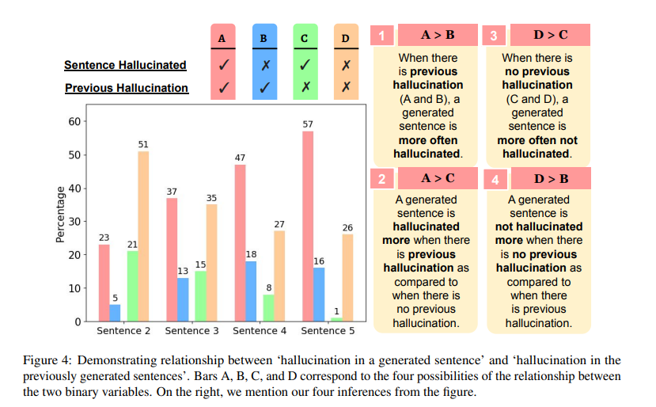

# Семантический шум



Семантический шум — это то, что превращает работу LLM из чёткого генератора ответов в источник иногда совершенно непредсказуемых фантазий. Для пользователя это выглядит так: где-то “поплыли” смыслы, где-то пошёл странный разброс, а где-то внезапно модель “решила” переписать структуру компании или бизнес-терминологию. Разберём, почему так происходит, и как отличать основные виды семантического шума друг от друга.

**Практика: Проверка вариативности (температура)**

**Инструменты:** PromptHub, Poe, Playground

**Алгоритм:**

1. *Промпт:* «Кто придумал интернет?»
2. Запусти генерацию ответа с разной температурой (0.2, 0.7, 1.0), 3–5 раз подряд.
3. Сравни, насколько сильно различаются версии, где появляется выдумка.
4. Проделай тоже самое, но теперь понижая Top P (0.2, 0.7, 1.0)
    
    **Ожидается:**
    
    Ты поймёшь, что даже при одинаковом вопросе LLM часто “угадывает”, а не извлекает точные знания.
    

---

### 1. Семантическая интерференция

Интерференция — это когда одно и то же слово или фраза для модели несёт сразу несколько значений. Модель не отличает “музыку” от “футбола” в слове *pitch*, “Mercury” для неё — это одновременно планета, металл и римский бог, если вы не задали явного контекста. Это делается сознательно, чтобы не тратить память на каждое значение, но “экономия” приводит к тому, что при генерации ответов смыслы начинают пересекаться.

**Пример:**

```
Write a few sentences about Mercury.
```

LLM может начать рассказ про планету, затем вдруг переключиться на автомобиль или химический элемент. В одном и том же абзаце легко встретить все три значения.

Особенно остро интерференция проявляется при few-shot промптах, где разные примеры используют слова в разных значениях — модель воспринимает все варианты как “один облачный смысл” и начинает мешать их в каждом новом ответе. Если вы даёте пример про “sales pitch”, второй — про “football pitch”, а третий — про “guitar pitch”, итоговый совет “for a good pitch” будет из всех этих сфер одновременно.

**Практика: Многозначность в ответах**

**Инструменты:** PromptHub, Poe

**Алгоритм:**

1. *Промпт:* «Напиши коротко о Mercury.»
2. Запусти несколько раз, сравни: модель пишет про планету, металл, автомобиль, бога?
3. Повтори с “bank”, “lead”, “pitch”.
    
    **Ожидается:**
    
    Увидишь, как LLM может путать смыслы, если нет чёткого контекста.
    

---

### 2. Семантическая энтропия

Когда интерференция уже есть, следующий шаг — рост энтропии: модель не знает, какой из смыслов выбрать, и начинает “метаться” между ними, раздавая ответы, которые могут быть совсем не похожи друг на друга. В целом, энтропия — это мера разброса смыслов внутри одного запроса: чем выше энтропия, тем больше вариантов того, что скажет LLM.

**Пример:**

Один раз модель расскажет про миграцию людей, второй — про миграцию данных между системами, третий — про миграцию птиц. Каждый раз — подробный, уверенный ответ, но в разном контексте.

Такое часто происходит с промптами в стиле COSTAR или Chain-of-Thought (CoT), где каждое действие разбито на шаги, но на каждом шаге есть “развилка” смыслов. Модель раз за разом углубляется в разные трактовки — итоговая цепочка рассуждений становится всё более запутанной, а шанс на появление галлюцинации растёт.

---

### 3. Онтологическая дрожь

Когда энтропия “достигла точки кипения” — смыслы не просто плавают, а модель начинает путать даже самые базовые понятия. Это и есть онтологическая дрожь: структура предметной области размывается, теряются чёткие границы между ролями, категориями и процессами. Дрожь — крайняя степень семантического шума, но иногда встречается и без явной энтропии, если обучающие данные модели были “размытыми”.

**Пример:**

```
Draw an org chart for: CEO, CTO, Team Lead, Developer, QA.
```

В одних случаях модель подчинит Team Lead напрямую CEO, в других — сделает его “половиной” отдела, в третьих — вообще объединит с QA. В агентском режиме (где LLM самостоятельно строит сложные структуры и ищет связи) дрожь особенно заметна: на каждую новую задачу модель может “придумывать” собственную структуру, каждый раз чуть отличающуюся от логики компании или индустрии.

---

### **Вывод для практики**

- Few-shot-примеры с разными смыслами усиливают интерференцию: LLM начнёт мешать смыслы.
- CoT-формат, где каждый шаг допускает разные трактовки, разгоняет энтропию: ответы становятся всё менее предсказуемыми.
- Схемы промтов вроде COSTAR/CLEAR усиливают разброс так как задают несколько правил, которые могут друг другу противоречить.
- Агентские режимы LLM усиливают онтологическую дрожь: чем больше свободы, тем больше “произвола” в структуре и связях.