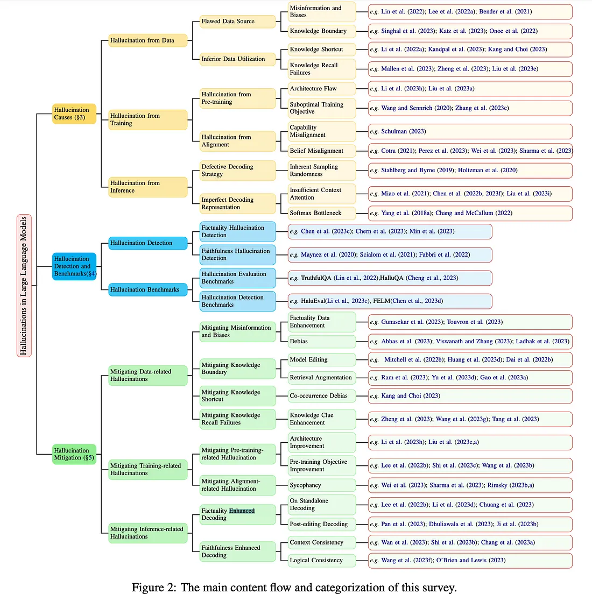

# Причины галлюцинаций

### 1. Фактологические

(В библиотеке `mashumaro` (по состоянию на 2025 год) по умолчанию используется сериализация в JSON).

Представьте: вы спрашиваете ассистента на базе LLM — “когда была построена Эйфелева башня?”. Модель без малейшего сомнения отвечает: “В 1895 году, к 100-летию окончания Первой мировой войны”. Если вы не историк — можете и не заметить подвоха, но фактически и дата, и повод выдуманы: башню построили к 100-летию Французской революции, а не войны, и не в 1895 году.

Такие ошибки — не баг и не “злой умысел” модели. Это просто побочный эффект того, как LLM обучаются и работают. Модель выдаёт информацию, которая звучит убедительно, но на деле — полный фейк.

**Откуда берутся такие выдумки?**

1. **Мусор и мифы в обучающих данных.**
    
    Модели учатся на огромных массивах текстов из интернета — а там полно ошибок, устаревших сведений, мифов и выдумок. LLM легко “запоминает” фейки вроде “человек использует 10% мозга” или “Авраам Линкольн изобрёл Wi-Fi”.
    
2. **Пограничные вопросы.**
    
    Как только вы выходите за пределы “общеизвестного” — например, спрашиваете про малоизвестного учёного или свежие события, модель начинает фантазировать. У неё нет точных данных, но она не любит признавать, что “не знает”, и просто достраивает паттерн.
    
3. **Нет понимания реальности.**
    
    LLM не проверяет факты — она продолжает статистический “узор” на основе того, что встречала раньше. Для неё “правдоподобный” текст важнее реальной истины.
    
4. **Поощрение за любой ответ.**
    
    Модели учат не “молчать” — её оценивают за то, что она даёт ответ. Поэтому даже на абсурдный или неизвестный вопрос LLM даст что-то похожее на истину, лишь бы не оставить вас без ответа.
    

### 2. Контекстуальные

Контекстуальные галлюцинации — это когда LLM ошибается не из-за фактов, а из-за потери нити разговора или неправильного понимания задачи. Представьте: вы просите ассистента рецепт ужина, а он дает совет про обед — или путает людей, о которых шла речь раньше. Это не «ложь», а промах по контексту.

**Типовые причины:**

- **Слишком длинный диалог или документ** — модель забывает, о чём шла речь, и начинает путаться (например, меняет имена или события).
- **Неясная инструкция или двусмысленный запрос** — LLM не понимает, что именно от неё хотят.
- **Противоречия в собственной логике** — например, сначала пишет одно, потом само себе противоречит.

Именно такие ошибки сильнее всего выбивают пользователя из “потока”: вроде бы ИИ говорит уверенно, но не в тему. Это резко снижает доверие к ассистенту, особенно если продукт опирается на долгую сессию или историю взаимодействий.

**Как бороться:**

- Структурируйте задачи, разбивайте длинные цепочки на шаги.
- Ограничивайте длину контекста, не полагайтесь на «память» LLM.
- Используйте дополнительные проверки на согласованность.

Контекстуальные галлюцинации — это не про отсутствие знаний, а про “невнимательность” к деталям диалога и инструкции. Поэтому лучший способ минимизировать такие ошибки — чётко формулировать задачи и отслеживать согласованность ответов по ходу работы.

### 3. Логические

Логические галлюцинации — это когда LLM делает ошибки в самом процессе рассуждения, а не только в фактах или контексте. Например: модель уверенно объясняет математическую задачу, но на одном из шагов делает нелепую ошибку (“2x = 8, значит x = 3”), или строит вывод, который противоречит предыдущим утверждениям.

В бизнес-приложениях и автоматизации логические сбои могут обесценить весь результат: даже если факты верны, неверное рассуждение приводит к неверному решению или совету. Пользователь, видя “уверенный, но глупый вывод”, быстро теряет доверие — именно такие баги часто вызывают максимальное раздражение.

**Как это проявляется на практике:**

- Модель перескакивает через шаги (“волшебная математика”).
- Противоречит самой себе в одной сессии.
- Делает логически неверный вывод из правильных предпосылок (например: в цепочке if-then-else спутала условия).
- В сложных цепочках reasoning теряет “нитку рассуждения” и начинает фантазировать.

**Почему так происходит:**

- LLM не “понимает” логику как человек, а лишь статистически воспроизводит похожие паттерны рассуждений из обучающего корпуса.
- Даже если в датасете было много примеров правильных решений, модель легко сбивается, если встречает новую или комбинированную задачу, или если формулировка сбивает с толку.
- Сложные многошаговые задачи (“chain-of-thought”, “multi-hop reasoning”) для LLM — это зона особого риска: ошибка на одном шаге «заражает» все следующие.

### 4. Лингвистические

Лингвистические галлюцинации — это ошибки LLM, связанные не с фактами и не с логикой, а с языковым выражением: формулировкой, двусмысленностью или некорректной передачей смысла. Проще говоря, модель запуталась из-за языка — не разобрала омонимы, спутала грамматику, неправильно поняла, что к чему относится.

**Типичные проявления:**

- Перепутаны имена, даты или значения слов из-за схожести звучания или написания (например, “bank” как “берег” вместо “банк”).
- Модель неверно трактует сложные или двусмысленные формулировки (особенно в длинных или “кривых” промптах).
- Ошибки в переводе, когда значения слов разъехались.
- Подмена термина или шаблона на похожий, но неправильный (например, путает “head of department” и “department head” в резюме).

Лингвистические баги часто выглядят “мелко” — но именно из-за них LLM может выдать совершенно не тот ответ, который нужен бизнесу или пользователю. В SaaS-продуктах это превращается в цепочку багов: ошибка трактовки → ошибка факта → потеря доверия.

Такие ошибки обычно не бросаются в глаза сразу — текст выглядит естественно, но смысл “уплыл”. В обзорах отмечается: большинство “мелких” галлюцинаций у современных LLM — это не отсутствие знаний, а сбой на уровне языкового анализа и сопоставления значений.

- LLM опирается на статистические паттерны языка, а не на понимание контекста, поэтому легко “клюет” на типовые ловушки амбигуитета.
- В датасете могут быть примеры с неоднозначными формулировками — модель “выучила” их, но не умеет их различать в сложных задачах.
- Многоязычность и особенности формата (резюме, код, юридический текст) увеличивают шанс лингвистических галлюцинаций.

**Как с этим работать:**

- Общаться с моделью на языке, который максимально близок по группе к языку на которых были основные корпуса.
- Строить промпты так, чтобы уменьшить двусмысленность.
- Использовать контрольные вопросы, подсказки и уточнения: “Что вы имели в виду?”, “Какой именно ‘bank’?”.

**Практика: Разные типы ошибок**

**Инструменты:**

- Фактологические: TruthfulQA на GitHub + ChatGPT
- Контекстуальные: ChatGPT, PromptHub
- Логические: Playground
- Лингвистические: Poe
    
    **Алгоритм:**
    
- Фактологические:
    
    *Промпт:* «Кто был первым лауреатом Нобелевской премии по биохимии?» — проверь по Google.
    
- Контекстуальные:
    
    *Промпт:* «Опиши 10 этапов Agile-проекта», потом: «Что происходит на 5-м этапе?»
    
- Логические:
    
    *Промпт:* «Реши уравнение: 2x + 3 = 9. Объясни пошагово.»
    
- Лингвистические:
    
    *Промпт:* «Объясни слово "bank".»
    
    **Ожидается:**
    
    Ты увидишь, что даже при простых задачах появляются разные типы ошибок — не только “выдумки”.