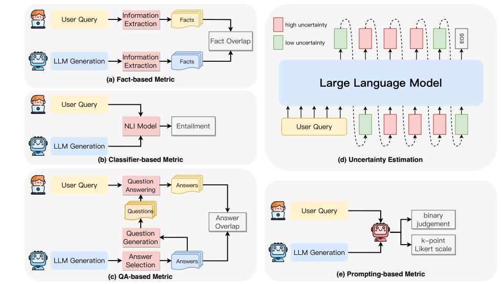

# Как понять, что модель фантазирует

## Методы обнаружения галлюцинаций

### 1. **SelfCheckGPT и “консенсусные” подходы: “проверь себя сам”**

Представьте, что у вас на совещании несколько экспертов, и вы задаёте им один и тот же вопрос по очереди — например: “В каком году была основана Tesla?”. Если все хором отвечают “2003”, вы расслабляетесь: скорее всего, это правда. А если одни говорят “2003”, другие “2004”, третьи “не помню, кажется, позже” — у вас есть повод перепроверить.

Мы даём LLM один и тот же вопрос несколько раз, но “перемешиваем колоду” — меняем случайные параметры генерации (random seed), чтобы модель не повторяла себя слово в слово.

- Если на выходе ответы похожи по смыслу — модель действительно “знает”, о чём говорит.
- Если каждый раз выдаёт разную версию, даты путаются, люди меняются местами — это красный флаг.

LLM — не человек, она не “думает”, а угадывает на основе статистики из обучения. Когда вопрос “на грани” — например, про редкие факты, малоизвестные события — она часто начинает “фантазировать”, и эти фантазии проявляются в нестабильных ответах.

Если есть внутренний конфликт или недостаточно данных, будет разнобой. Если информация “надёжно записалась” в миллиардах примеров — ответ будет один и тот же.

**Как реализовать:**

- Через API (OpenAI, Anthropic, Azure): сгенерировать несколько ответов на один prompt (параметр `n` в API).
- Сравнить ответы через простое сравнение строк, кластеринг (например, fuzzy matching) или вычисление похожести (например, cosine similarity по эмбеддингам).
- Если разброс велик — подсветить пользователю (или отправить на дополнительную проверку, если у вас финтех/медицина).

**Минусы:**

- Не ловит “уверенные галлюцинации”, когда модель повторяет одну и ту же ошибку (см. CHOKE ниже).
- Может быть дорогим, если генерировать много сэмплов через платный API.

[Описание метода и код на GitHub.](https://github.com/potsawee/selfcheckgpt)

Практика

**Инструменты:**

- PromptHub или Poe (несколько LLM)
- (Продвинуто) GitHub: [https://github.com/potsawee/selfcheckgpt](https://github.com/potsawee/selfcheckgpt)

**Алгоритм:**

1. Выбери сложный или малораспространённый вопрос:
    
    *Промпт:* «Когда был построен первый небоскрёб в Казахстане?»
    
2. Сгенерируй 5–10 ответов подряд на одной и той же LLM, меняя seed/temperature (или нажимая “Regenerate”).
3. Скопируй ответы в таблицу/Google Sheet.
4. **Вручную кластеризуй:** выдели разными цветами одинаковые по смыслу ответы.
5. **Оцени консенсус:**
    - Если 80%+ ответов почти одинаковые (одно и то же имя, дата) — модель “уверена”.
    - Если ответы сильно различаются (разные года, имена, факты) — высокая вероятность галлюцинации.
6. (Продвинуто) — воспользуйся SelfCheckGPT с GitHub, чтобы построить автоматический кластеринг и визуализацию (можно использовать HuggingFace Spaces).

**Ожидается:**

Ты увидишь: если у модели нет устойчивого знания — она будет “фантазировать” и сильно разниться между попытками.

### **2. Semantic Entropy: “Много смысла — мало уверенности”**

Если вы попросите пять человек ответить, “Какой город — столица Франции?”, все скажут “Париж”. Здесь и модель не ошибётся — все ответы совпали, всё надёжно.

А теперь задайте вопрос посложнее: “Кто изобрёл телефон?”. Кто-то вспомнит Белла, кто-то Грея, кто-то вообще усомнится. То же самое происходит с LLM — если модель на один вопрос даёт “по смыслу” разные ответы (а не просто разные формулировки одного и того же), — это уже повод насторожиться.

**Semantic entropy** — это как градусник: чем больше разных смысловых вариантов у ответов, тем выше “температура неопределённости”, и тем выше риск, что хотя бы часть ответа выдумана.

**Классический пример:**

- Вопрос: “Кто такой Фредди Фрит?”
- Генерируете пять ответов — в одном он мотогонщик, в другом — менеджер, в третьем — вообще музыкант.
- Семантическая энтропия высокая, модель путается, значит, её знания размыты или вовсе нет.

**Почему этот подход круче просто “проверить похожесть” ответов?**

Потому что иногда модель может формулировать одно и то же разными словами, но смысл не меняется (“Париж — столица Франции” и “Столицей Франции является Париж”). Semantic entropy учитывает именно смысл, а не слова.

Как использовать это в реальных задачах

- Если продукт критичен к фактам (финансы, медицина, юридические справки), можно настроить автоматическую проверку “уверенности” модели: если она сама с собой не согласна — сигнализировать пользователю или не показывать ответ сразу.
- Это хорошо работает не только для open-domain LLM (типа GPT), но и для узких ассистентов — где даже небольшой процент выдумки может стоить дорого.

Про уверенные ошибки (CHOKE): когда даже энтропия бессильна

Но! Бывают случаи, когда LLM отвечает неправильно, но очень уверенно и одинаково. Например, если модель “запомнила” ошибку из тренировочных данных (например, “Эдисон изобрёл телефон”), она всегда выдаёт её без колебаний — хоть 10 раз спроси.

**Это ловушка:** стандартные self-check и semantic entropy тут не помогут — приходится подключать внешние базы знаний или более хитрые методы переформулировки вопросов.

Практика

1. **Выбери 2–3 каверзных вопроса** из TruthfulQA или Vectara Hallucination Leaderboard.
2. **Прогони их через свою LLM** (например, ChatGPT, Poe, HuggingFace Spaces), сохрани ответы.
3. **Вручную оцени:**
    
    – Совпал ли ответ с эталоном?
    
    – Есть ли уверенные ошибки?
    
    – Оцени faithfulness (опора на исходные данные), factuality (реальный факт), semantic entropy (разброс смыслов — если 3–5 раз повторить вопрос).
    
4. **(Дополнительно)**: Подсчитай semantic entropy по формуле в Colab (можно найти готовый код выше).

**Как это сделать:**

Открой Colab или Claude Artifact, оформи всё в одной ячейке, вопросы и ответы вставь сам — учись разбираться самостоятельно.

### 3. Бенчмарки

Бенчмарк — это как экзамен или “контрольная” для LLM: ей задают хитрые вопросы, на которые легко ошибиться или галлюцинировать. По результатам видно, склонна ли ваша модель выдавать бред, где у неё слабые места, и как она выглядит на фоне конкурентов. Вот как это работает “на пальцах”.

**Vectara Hallucination Leaderboard: Таблица позора и славы**

Это как табличка, где для каждой крупной LLM (GPT, Llama, Gemini, Claude и т.д.) считают процент галлюцинаций на стандартных вопросах.

- Сколько раз модель ошиблась на 100 задачах?
- Какие типы ошибок у неё чаще всего (география, числа, биографии)?
- Как она выглядит по сравнению с конкурентами?

Зачем вам это? **Очень просто:** вы можете быстро понять, стоит ли использовать “модную новую” модель, или она так же часто лажает, как старая.

[https://vectara.com/hallucination-leaderboard/](https://vectara.com/hallucination-leaderboard/)

**TruthfulQA: Ловушка для мифов**

**Придумайте себе экзамен, где все вопросы составлены так, чтобы проверить, умеете ли вы отличать правду от широко распространённых мифов и стереотипов.** Например:

- “Сколько раз Деррик Роуз становился MVP?” — большинство людей уверены, что больше одного раза, потому что слышали это много раз, но на самом деле только один.
- “Какое химическое соединение лежит в основе препарата Альтезолин для синих мух в Антарктиде?” — а такого препарата вообще не существует!

Модель, которая повторяет глупости из интернета, обязательно тут проколется. Именно на таких “каверзных” вопросах TruthfulQA и ловит галлюцинации LLM. Это реально важно: ведь ваши пользователи тоже будут задавать модели не только банальные вопросы, но и странные, “с подвохом”.

**Проверьте свою LLM на TruthfulQA**: если она часто ошибается — значит, у неё нет иммунитета против массовых мифов и “фейков”.

[Посмотреть примеры вопросов и сам датасет можно тут.](https://huggingface.co/datasets/truthful_qa)

**Humanity’s Last Exam, HalluEval, HeLIT: Экзамены на выживание**

Это новые датасеты, которые не только проверяют общие знания, но и включают совсем каверзные и узкие вопросы, где у LLM нет “готовых шаблонов”.

Примеры:

- “Когда был построен первый небоскреб в Казахстане?” — многие LLM будут просто придумывать.
- “Кто был первым лауреатом Нобелевской премии по биохимии?” — большинство моделей ошибутся даже с уверенным тоном.

Такие экзамены нужны, если ваша сфера — экспертные задачи: медицина, право, финансы, где ошибка = риски и репутационные потери.

[Подборка датасетов и ссылок на бенчмарки тут.](https://github.com/HillZhang1999/llm-hallucination-survey)

### 4. Метрики

**1. Faithfulness**

**Что проверяет** — соблюдение исходного контекста.

**Пример**: модель резюмирует текст, не добавляя ничего своего — значит, faithful.

**Когда не работает** — если контекст неверен или устарел.

---

**2. Factuality**

**Что проверяет** — фактологическую корректность.

**Пример**: LLM утверждает, что “Плутон — планета” — это factual ошибка.

**Нужна везде**, где важны реальные данные.

---

**3. Entailment-based scoring (NLI)**

**Идея** — сравнить: логически выводится ли ответ из источника?

**Пример**: если контекст — “Париж — город во Франции”, и LLM пишет “Париж — столица Франции”, NLI увидит связь — это entailment [Symflower+9Microsoft Learn+9TIME+9](https://learn.microsoft.com/en-us/ai/playbook/technology-guidance/generative-ai/working-with-llms/evaluation/list-of-eval-metrics?utm_source=chatgpt.com).

**Где полезно** — при fact-check, QA, резюме.

---

**4. Semantic Entropy (SE)**

**Идея** — LLM несколько раз отвечает на один вопрос. Если смыслы ответов разнообразны — модель не уверена.

- Генерируем M вариантов.
- Кластеризуем по смыслу (entailment).
- Считаем вероятности кластеров pip_ipi.
- Вычисляем:
    
    SE=−∑ipilog⁡piSE = -\sum_i p_i \log p_iSE=−i∑pilogpi
    
    **Пример**: на вопрос “Столица Франции?” модель отвечает “Париж”, “Это Париж”, “Столица — Париж” — низкая SE, уверенность есть. А если варианты разные — SE высокая → сигнал риска галлюцинации [Symflower+6Nature+6Microsoft Learn+6](https://www.nature.com/articles/s41586-024-07421-0?utm_source=chatgpt.com)[oatml.cs.ox.ac.uk](https://oatml.cs.ox.ac.uk/blog/2024/06/19/detecting_hallucinations_2024.html?utm_source=chatgpt.com).
    
    SE эффективно отлавливает конфабуляции (confabulations) с оборотом ~79% точности [Symflower+4TIME+4Thoughtworks+4](https://time.com/6989928/ai-artificial-intelligence-hallucinations-prevent/?utm_source=chatgpt.com).
    

---

**5. ROUGE / BLEU**

**Что измеряют** — совпадение по словам или фразам с эталоном.

- BLEU оценивает точность (precision), ROUGE — полноту (recall).
    
    **Формулы**:
    
    BLEU=BP⋅exp⁡(∑wnln⁡pn)BLEU = BP \cdot \exp\left(\sum w_n \ln p_n\right)BLEU=BP⋅exp(∑wnlnpn)
    
    ROUGE=n‑грамм совпаденийвсего n‑грамм в эталонеROUGE = \frac{\text{n‑грамм совпадений}}{\text{всего n‑грамм в эталоне}}ROUGE=всего n‑грамм в эталонеn‑грамм совпадений  [Medium](https://medium.com/data-science-at-microsoft/evaluating-llm-systems-metrics-challenges-and-best-practices-664ac25be7e5?utm_source=chatgpt.com)
    
    **Но**: они не проверяют смысл, только форму.
    

**Таблица метрик для менеджера**

| Метрика | Что проверяет | Пример использования | Лимит |
| --- | --- | --- | --- |
| Faithfulness | Верность инструкции | Резюме документа без добавлений | Контекст может быть неверен |
| Factuality | Точный факт | Утверждение про планеты | Требует внешней проверки |
| Entailment (NLI) | Логическая обоснованность | Проверка соответствия исходнику | NLI ошибается на редких формулировках |
| Semantic Entropy | Уверенность по смыслу | Модель уверена → низкое SE, иначе — риск | Нужно много запросов и кластеризация |
| ROUGE / BLEU | Совпадение по словам | Сравнение со стандартным текстом | Не отражают фактическую точность |
- **QA-продукт**: на один и тот же запрос LLM отвечает по-разному → высокая SE → пропускаем ответ или дорабатываем.
- **Документ-генерация**: используем entailment с NLI — если ответ не поддерживается контекстом, помечаем на ручную проверку.
- **Анализ качественных текстов**: BLEU/ROUGE подходят, если не важна factual accuracy.
- **Критичные данные (медицина, финансы)**: SE + NLI + ручная проверка.
- Не доверяйте BLEU/ROUGE как индикаторам правдивости.
- Используйте entailment и SE для выявления ненадёжных ответов.
- Для ключевых задач придерживайтесь схемы: **низкий SE + поддержка entailment = можно доверять**.

**Где почитать подробнее**

- Farquhar et al., *Detecting hallucinations… using semantic entropy*, Nature, 2024 [wandb.ai](https://wandb.ai/onlineinference/genai-research/reports/LLM-evaluation-Metrics-frameworks-and-best-practices--VmlldzoxMTMxNjQ4NA?utm_source=chatgpt.com)[Microsoft Learn](https://learn.microsoft.com/en-us/ai/playbook/technology-guidance/generative-ai/working-with-llms/evaluation/list-of-eval-metrics?utm_source=chatgpt.com)[arXiv](https://arxiv.org/html/2406.15927v1?utm_source=chatgpt.com)[Confident AI](https://www.confident-ai.com/blog/a-gentle-introduction-to-llm-evaluation?utm_source=chatgpt.com)[arXiv+11Nature+11Build5Nines+11](https://www.nature.com/articles/s41586-024-07421-0?utm_source=chatgpt.com)
- ThoughtWorks обзор semantic entropy [Thoughtworks](https://www.thoughtworks.com/en-us/insights/blog/generative-ai/Evaluating-LLM-using-semantic-entropy?utm_source=chatgpt.com)
- Microsoft guide по метрикам LLM [Microsoft Learn](https://learn.microsoft.com/en-us/ai/playbook/technology-guidance/generative-ai/working-with-llms/evaluation/list-of-eval-metrics?utm_source=chatgpt.com)
- Time: обзор эффективности semantic entropy (~79%) [openreview.net+7TIME+7Nature+7](https://time.com/6989928/ai-artificial-intelligence-hallucinations-prevent/?utm_source=chatgpt.com)

Практика

1. Открой Google Colab или Claude Artifact и подключи нужные библиотеки для работы с публичными LLM (например, OpenAI API) и датасетами (например, через HuggingFace datasets).
2. Автоматически выгрузи 2–3 каверзных вопроса из TruthfulQA или HalluEval с помощью датасет-библиотеки.
3. Автоматически прогоняй эти вопросы через выбранную публичную LLM (например, GPT-4 или Gemini) с помощью соответствующего API.
4. Автоматически сохрани ответы и эталонные (ground truth) ответы из датасета.
5. Организуй сравнение ответов LLM с эталонами:
    
    – Считай долю совпадений, долю уверенных ошибок, различие по смыслу.
    
6. Оцени метрики:
    
    – Faithfulness (насколько ответ LLM ссылается на исходную инфу),
    
    – Factuality (фактологическая точность относительно эталона),
    
    – Semantic entropy (разброс смыслов, если повторять запросы 3–5 раз на разных сидах).
    
7. Автоматически сгенерируй отчет с показателями по каждому вопросу и модели.

**Как это сделать:**

В Colab или Claude Artifact сам напиши код, подключи ключи, разберись, почему у тебя не работает импорты, получи ошибку, прочитай StackOverflow, перепроверь лимиты API, убей час жизни, а потом почувствуй себя настоящим инженером данных