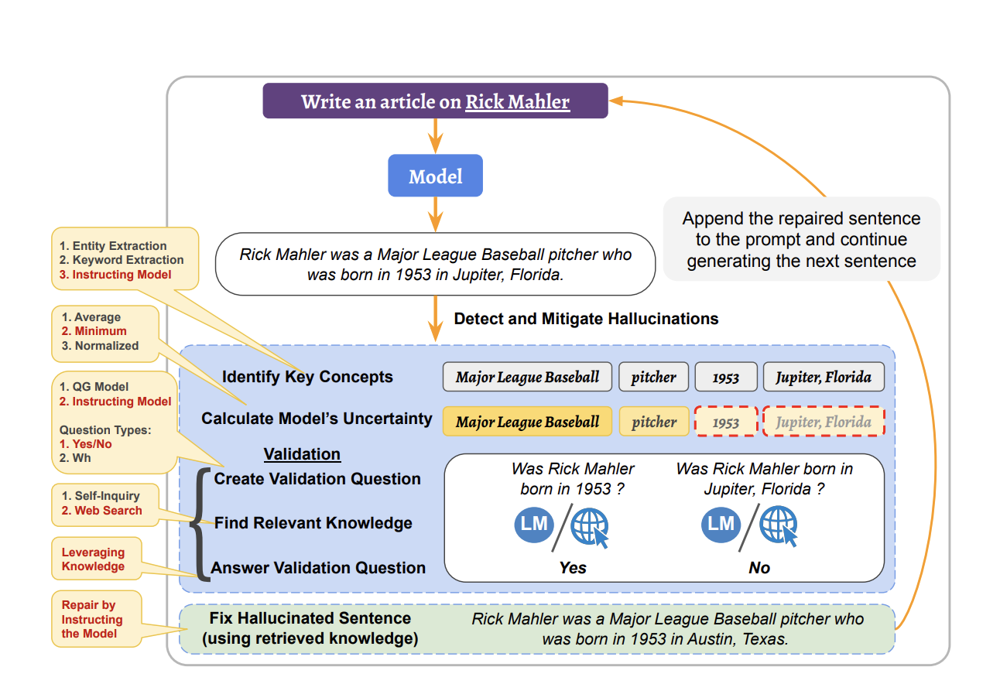

# Что делать: инженерия и практики

## Приёмы снижения галлюцинаций

### 1. Инженерия промптов

1. **ICE (Instruction, Constraints, Escalation)**
    - **Instruction**: чётко сформулируйте, что вы хотите получить (например, "дай только список стран").
    - **Constraints**: укажите ограничения — например, "используй только факты из 2020 года" или "не придумывай, если не знаешь".
    - **Escalation**: заложите сценарий «не знаю» — например, попросите явно отвечать “нет данных” или “не уверен”, если нет фактической информации.
    - Эта структура повышает прозрачность вывода и уменьшает количество выдуманных деталей.
2. **Step-Back Prompting**
    - Просим модель "остановиться и подумать": например, сначала попросить оценить свою уверенность или разложить задачу на шаги.
    - Такая техника снижает "импульсивные" галлюцинации, когда модель сразу выдаёт первое "угаданное" значение, не проверяя его внутренне.
    - Вариация: спросите модель, какие есть альтернативные версии ответа или какие данные нужны для проверки.
3. **Chain-of-Verification**
    - Встраиваем в промпт явные инструкции по верификации: сначала сгенерируй ответ, затем придумай вопросы для самопроверки, затем перепроверь их по имеющимся фактам.
    - Например: "Дай короткий ответ, затем сформулируй два уточняющих вопроса, которые помогут проверить твой ответ, и попробуй на них ответить".
    - Такой подход хорошо работает в задачах поиска информации и аналитики, снижая количество очевидных ошибок и упрощая аудит результата.
4. **Veracity Classification Prompts**
    - Добавьте в промпт шаг "оцени достоверность каждого факта" или "дай вероятность, что факт верный".
    - Позволяет быстро выявлять "слабые места" в сгенерированном ответе, хотя не всегда полностью устраняет галлюцинации, т.к. модель может быть уверена в неверном ответе.

**Практика**

*Промпт без структуры:*

«Объясни роль Scrum Master.»

*Промпт:*

«Перечисли только фактические обязанности Scrum Master в формате списка. Используй только проверенные источники (например, Scrum Guide). Если есть сомнения — напиши “нет данных” или “не уверен”.»

---

- *Промпт:*
    
    «Перед тем как ответить, оцени свою уверенность в знании темы (в процентах). После этого разложи роль Scrum Master на шаги: сначала опиши ключевые задачи, потом дай итоговое резюме.»
    

---

- *Промпт:*
    
    «Дай краткий ответ на вопрос “Что делает Scrum Master?”. Затем сформулируй два вопроса для самопроверки и попытайся ответить на них, используя только официальные материалы по Scrum.»
    

---

- *Промпт:*
    
    «Перечисли обязанности Scrum Master, а рядом с каждым пунктом укажи: (а) насколько ты уверен в его достоверности (в процентах), (б) укажи источник, если есть.»
    

---

5. A/B/С/… Playground Test

1. Открой PromptHub/Poe или любой playground, где можно создавать пайпы с разными промптами.
2. Создай отдельные пайпы для каждого подхода (ICE, Step-Back, Chain-of-Verification, Veracity Classification).
3. Используй одну и ту же LLM (например, GPT-4, Claude, Gemini) для всех пайпов — чтобы сравнивать именно структуру промпта.
4. Прогоняй один и тот же вопрос через каждый пайп.
5. Оцени результаты:
    - Где ответ точнее и прозрачнее?
    - Где модель честнее признаёт “не знаю”?
    - Где меньше “воды” и очевидных галлюцинаций?
    - Сделай A/B/C сравнение для одного вопроса (ручной scoring или Google Forms с оценкой по шкале faithfulness/factuality).
6. Если playground поддерживает “мульти-запуск” (batch/pipe), прогони сразу несколько тем или вопросов.

### 2. Системные подходы

**1. Инженерия контекста (Context Engineering)**

Это не просто “правильная формулировка промпта”, а осознанное управление всей информацией, которую получает LLM: инструкции, ввод пользователя, история, внешние факты, ограничения. Контекст — это как “оперативная память” ИИ.

- **Фильтрация и структура** помогают не “захламлять” внимание модели: если контекст чётко разделён (например, `[ИНСТРУКЦИЯ]`, `[ИСТОРИЯ]`, `[ДАННЫЕ]`), модель реже путается между целями задачи и “додумывает”.
- **Иерархия важности** (важное впереди, шум убран) снижает риск “контекстного дрейфа” — когда модель начинает опираться на несущественные детали или старые сообщения.
- **Явные ограничения** (“не делай предположений, если данных нет — напиши ‘нет данных’”) заставляют модель признавать незнание, а не фантазировать.

В корпоративном ассистенте при запросе “кто одобряет командировки?” промпт включает: “Используй только политику из базы. Если в политике нет информации, напиши: ‘Информация отсутствует’.” Это снижает число галлюцинаций, когда ИИ мог бы “придумать” ответ, основываясь на шаблонах из общедоступных данных.

**Ключевые нюансы:**

- Контекст легко “засорить” старыми или противоречивыми кусками — поэтому регулярная чистка и структурирование обязательны для стабильной работы.
- **Контекстная изоляция**: если параллельно идут разные задачи — разделяйте их память, иначе модель начнёт смешивать инструкции и результаты (типичный источник “системных галлюцинаций”.

Практика

Соберите нодовый пайплайн в n8n, который автоматизирует:

1. **Извлечение контекста** по davidkimai/Context‑Engineering (используем инструкции, примеры — templates).
2. **Формирование промпта** с несколькими блоками контекста (instructions + примеры + память пользователя).
3. **Запрос** к LLM через OpenAI или другой node.
4. **Возврат** ответа в Telegram-чат, где спрашивал пользователь.

**Что получите:**

- Написанный бота, автоматом подставляющего контекст в промпт.
- Видите сразу: без контекста — ответ хаотичный; с контекстом — структурированный, без “галлюцинаций”.

**Почему это важно:**

Поиск в `Context‑Engineering` — это базовый шаблон «сборка контекста + LLM». Здесь вы на практике увидите, как строгая контекст-инъекция влияет на качество ответов и отключает “липовую” генерацию.

---

**Выполните:**

1. Клонируйте репозиторий `Context‑Engineering` и выберите пару примеров из `20_templates/`.
2. Сконфигурируйте n8n:
    - Telegram Trigger → HTTP Request (шаблон) → Set (собрать контекст) → LLM Node → Telegram Send.
3. Проверьте пару запросов с и без шаблонов.
4. Оптимизируйте порядок контекста, убедитесь, что получаете более точные и логичные ответы.

---

**2. RAG (Retrieval-Augmented Generation)**

Механизм, при котором LLM не просто генерирует ответ “из головы”, а подтягивает релевантные факты из базы (FAQ, документы, корпоративные регламенты, интернет).

**Почему снижает галлюцинации:**

- Галлюцинации часто появляются, когда модель вынуждена “догадываться” на неполном знании. RAG даёт ей “свежий” материал для ответа, минимизируя число домыслов.
- *LLM с RAG на 20–30% точнее отвечает на вопросы, где требуются факты, не попавшие в её обучение*. Но если поиск возвращает нерелевантное, ошибка переходит на следующий этап (важность фильтрации).

Сотрудник спрашивает про новую HR-политику. Ассистент с RAG обращается к свежим инструкциям в базе — и возвращает цитату с точной ссылкой, а не стандартный или устаревший ответ.

RAG не отменяет проверки: если в базе нет нужного, LLM может всё равно “придумать” ответ. Поэтому важно комбинировать RAG с инженерией контекста: “Отвечай только если нашёл релевантный документ, иначе — ‘нет данных’”.

**Практика**

1. **Возьмите профессиональную книгу** (например, Scrum Guide Expansion Pack 2025).
2. **Составьте 12 вопросов** по ключевым разделам книги.
3. **Подготовьте “золотой” бенчмарк**: для каждого вопроса выпишите эталонный (короткий и точный) правильный ответ, опираясь на сам текст книги.
4. **Задайте каждый вопрос обычной LLM** (например, DeepSeek или другую в playground) по 10 раз — итого получите 120 ответов.
5. **Сравните все ответы с бенчмарком**:
    
    – вручную (или с помощью simple script) оцените совпадения, неточности, галлюцинации;
    
    – посчитайте долю верных, неверных и “галлюцинаторных” ответов.
    
6. **Векторизуйте книгу и настройте RAG** (например, через HuggingFace/FAISS, Haystack или Pinecone, неважно — любой доступный пайплайн).
7. **Повторите те же 12 вопросов по 10 раз** уже через RAG — снова получите 120 ответов.
8. **Сравните метрики по бенчмарку для обычной LLM и для LLM+RAG**:
    
    – где выше точность, где меньше выдумки, где больше ссылок на оригинал.
    
9. **Сделайте выводы — в чем и насколько RAG улучшил реальную “фактологическую” устойчивость вашей LLM.**

---

**3. Web search / Deep research base**

Подключение к онлайн-поиску (новости, аналитика, научные базы). Это расширяет возможности RAG: ищем не только внутри компании, но и “во внешнем мире”.

- Позволяет найти подтверждение факта или опровергнуть устаревшие сведения, если внутри компании данных нет.
- **Но!** Как показано в обзорах, без жёсткой фильтрации найденной информации AI может “подцепить” фейк, устаревшую новость или фрагмент, не относящийся к вопросу — и уверенно её сгенерировать.

AI-ассистент анализирует новости конкурентов. Он подтягивает только те статьи, где упоминается конкретная компания и фильтрует по дате публикации, чтобы не ссылаться на старую информацию.

Web search — полезен для “белых пятен” (новое, уникальное), но требует валидации: либо ручной проверки источника, либо автоматического “гварда” на факты.

---

**4. Семантические графы (Knowledge Graphs)**

Использование структур знаний (связи между людьми, процессами, документами), чтобы AI делал выводы на основе реальных связей, а не только на статистике текста.

- Модель опирается на конкретные связи, что снижает риск “ошибочных сопоставлений” (например, не перепутает похожие термины или отделы).
- Внедрение графов особенно эффективно в сложных, многосвязных бизнес-процессах — уровень ошибок при поиске информации снижается, ответы становятся повторяемыми и обоснованными.

Менеджер спрашивает: “Кто отвечает за направление X?”. AI достаёт связь из графа “Проект → Руководитель” и возвращает не предположение, а реальную структурную единицу.

---

**5. Domain-specific knowledge → LoRA / Fine-tuning**

Лёгкое дообучение на своей базе кейсов (LoRA), либо полноценное дообучение модели на профессиональных данных.

- Уменьшает ошибки и “фантазию” в терминологии, редких ситуациях и внутренних процедурах.
- В исследованиях (Ji et al. 2023, Huang et al. 2024) доменное дообучение снижает количество галлюцинаций и повышает вероятность честного “не знаю” вместо излишней уверенности в неправильном ответе.

После дообучения на документах техподдержки AI перестаёт предлагать несуществующие способы решения, а использует только реальные инструкции компании.

**Ключевые нюансы:**

- Критична “чистота” и актуальность данных для обучения: иначе новая ошибка становится системной.
- Лучше использовать регулярное обновление и ревизию базы знаний.

---

**6. Guardrails / Output validation**

Многоуровневые проверки на этапе выдачи ответа. Это фильтры, повторные вопросы, сравнение с эталонными ответами или автоматический мета-анализ (SelfCheckGPT, Chain-of-Verification, LLM-Check).

- Ловит “выдумки” на последнем этапе: если даже предыдущие фильтры пропустили ошибку, guardrail проверит ответ повторно или сверит с источниками.
- В [LLM-Check, 2023] показано, что такие фильтры снижают число критических галлюцинаций до 2–5% (против 10–15% без них).

AI генерирует отчёт, и после этого специальный модуль задаёт ему уточняющий вопрос: “Подтверди все факты ссылками на источник”. Если подтверждение не найдено — менеджер получает предупреждение о возможной галлюцинации.

Можно комбинировать “мягкие” фильтры (уведомить пользователя о сомнительном факте) и “жёсткие” (блокировать ответ или требовать дополнительного подтверждения).

### 3. Житейские подходы

**Перекрёстная проверка: «спроси ещё одну модель»**

Один из самых простых и эффективных приёмов — проверить сомнительный ответ LLM через другой сервис или «дать ответу пройти тест на суровую реальность». Например: получили ответ от ChatGPT — задайте тот же вопрос Gemini, Claude или даже более старой версии ChatGPT. Такой способ называется LLM-as-a-judge или cross-LLM validation.

- Исследования показывают, что модели часто галлюцинируют независимо друг от друга, но вероятность одинаковой ошибки у нескольких моделей ниже.
- Если 2–3 модели выдали одно и то же (или почти совпадающее) по смыслу, скорее всего, информация верна.
- Если разброс большой — это сигнал насторожиться и пойти искать подтверждение в внешних источниках или ручками в Google

**Минусы:**

- Некоторые LLM могут «копировать» популярные ошибки друг у друга, особенно на трендовых данных или на одних и тех же датасетах.
- Метод не работает на редких вопросах, где моделей просто нечему «сверяться» (нет консенсуса).

**Критическое мышление: «поверь, но проверь»**

Наконец, любой автоматический инструмент — не замена человеческому скепсису. Исследования и рекомендации крупных компаний (Microsoft, OpenAI, Red Hat) советуют всегда проверять ответы LLM с позиции: «Если бы мне это сказал стажёр — я бы поверил?» Или: «Смогу ли я подтвердить это в авторитетных источниках?»

**Практические советы:**

- Не принимайте на веру факты, особенно если они необычные, важные для бизнеса или принимаются для принятия решений.
- Привычка «гуглить» непонятные факты и сверяться с первоисточниками работает не хуже, чем многие автоматические проверки.
- В высокорисковых сценариях (медицина, финансы, юриспруденция) — только с верификацией через профильных специалистов или документацию.

### 4. Перспективные подходы

В последние годы одними из самых перспективных направлений в борьбе с галлюцинациями LLM считаются интеграция языковых моделей с внешними источниками знаний (например, knowledge graphs — графы знаний) и развитие подходов "прозрачного" ИИ, где модель прямо показывает, какие источники и инструменты использует для вывода. Пример: Toolformer — архитектура, в которой LLM учится использовать внешние инструменты и API для уточнения фактов или выполнения операций.

Традиционные LLM работают как “черный ящик”: они генерируют текст на основе статистики из обучающих данных, не объясняя свои решения и не ссылаясь на источники. Это приводит к двум ключевым проблемам:

- Пользователь не понимает, насколько ответ основан на реальных фактах.
- Даже если модель уверена, она может “галлюцинировать” — выдавать несуществующую или ошибочную информацию с очень убедительным видом.

Классическая проблема: LLM часто "выдумывает" факты, которых нет ни в обучении, ни в реальности. Но если модель получает возможность запрашивать, интегрировать и ссылаться на knowledge graph (структурированная база данных фактов) или называть используемые внешние инструменты, вероятность галлюцинаций резко падает:

- Модель проверяет и подставляет реальные факты из базы (например, Wikidata или корпоративного справочника).
- Прозрачная цепочка рассуждений позволяет понять, когда LLM “перепутала” источник или домыслила.

**Куда развивается рынок и исследования**

- **Тенденция**: всё больше новых LLM (особенно в B2B-продуктах) “умеют” работать с внешними базами, проверять факты на лету и объяснять свои действия — это стандарт де-факто в современных корпоративных решениях.
- **Горячие темы**: построение “explainable AI”, генерация ссылок на источник в реальном времени, аудит reasoning chain, развитие инструментальных LLM (Toolformer, AutoGPT и т.д.).

**Вывод**

Для менеджеров и практиков ключевой урок: если вы строите сервис с LLM и хотите минимизировать галлюцинации, фокусируйтесь на интеграции с проверяемыми источниками знаний и прозрачности reasoning. Даже лучшие языковые модели не гарантируют стопроцентной точности “из коробки”, но современные “knowledge-augmented” и “tool-using” подходы — мощный инструмент против галлюцинаций.